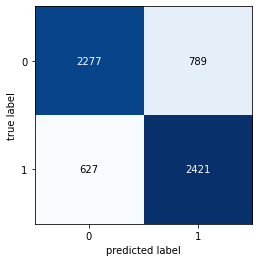
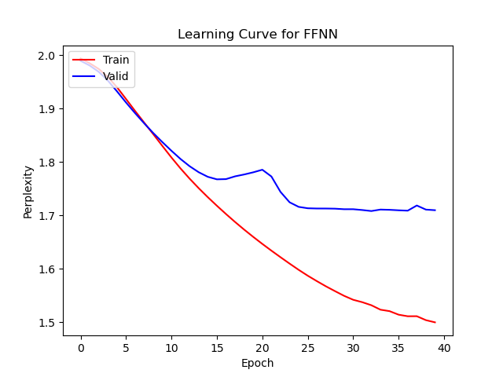
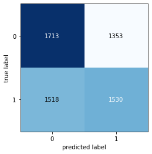
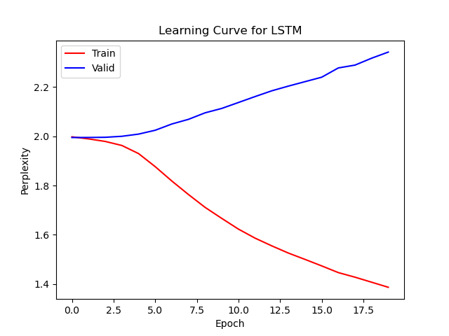

# 497_HW1

Link to saved FFNN model [here](https://drive.google.com/file/d/170jJpL88yRravZqh78C6oDH9oEqJQ0ZN/view?usp=sharing).

Link to saved LSTM model [here](https://drive.google.com/file/d/1W_LZTNmZ5NIhET-sHn-NfqXbMZDkz8Rb/view?usp=sharing).

Place these files in the source directory of the project code to run. After having done so, please call ./run_code.sh to launch the python code that reports on the results of our trained models (FFNN, LSTM, and best model).

# Tasks

## 1. FFNN

[Please describe how you organized and used the datasets provided, the operation of your FFNN and hyper-parameter settings. Present the learning curves for training and test perplexity, and report Fakes Detection results in a confusion matrix with labeled axes. Please discuss any limitations of your approach and possible solutions. Please do not exceed one page for this.]

### Setup

We organized the datasets into subsets of training sets and validation / testing, where we used the 24,000 train biographies as our training dataset, the remaining 6,000 biographies as our validation set, and the 500 blind inputs as our test dataset. We split each corpus using the "<start_bio>...<end_bio>" tags, considering everything in between as a standalone biography. We then extracted the [Real] or [Fake] label and attributed that label to the biography. We stored this information in a pandas dataframe containing 3 columns: *processed_tokens*, *Class*, and *Train (type)*. The first contains the processed tokens as an array (processed using available gensim Python library), the second contains the label, and the third contains a boolean value indicating whether the biography is part of the training set or not. We then used the *processed_tokens* and *Class* columns to train the FFNN and the *Train (type)* column to split the data into training and validation / testing sets. We used the *processed_tokens* column to train the FFNN. We pass in our input of batch_size Bag-of-words vectors to our FFNN model (built individually using the tokens by keeping a dictionary of counters for each token), which then goes through a number of hidden layers and Tanh activation functions, until calling a softmax function to return an output of 2 values, signifying the probabilities of the biography being fake and real, respectively.

### Model Parameters

batch_size=20, number_of_hidden_layers=4, input_dim=vocab_size, hidden_dim=128, lr=0.001, epochs=40

### Results

### Limitations and solutions

Our model has been pretty thoroughly searched when it comes to hyperparameters, however our biggest limitation with the given model is the fact that sequential data is not stored as information for inputs in our model. This is due to the fact that the Bag-of-words vectors only keep track of token counts, yet do not store much information about the sequential order. Our best suggestions for avoiding this issue is to either use RNN-based models that store sequential data or use an input vector that stores the token IDs in sequential order (although this may then cause a large memory constraint on our model, so it's not really that preferred).

## 2. LSTM

[Please describe how you organized and used the datasets provided, the operation of your LSTM LM and hyper-parameter settings. Present the learning curves for training and test perplexity, and report Fakes Detection results in a confusion matrix with labeled axes. Please discuss any limitations of your approach and possible solutions. Please do not exceed one page for this.]

### Setup

Similarly to the FFNN model, we organized the datasets into subsets of training sets and validation / testing, where we used the 24,000 train biographies as our training dataset, the remaining 6,000 biographies as our validation set, and the 500 blind inputs as our test dataset. We split each corpus using the "<start_bio>...<end_bio>" tags, considering everything in between as a standalone biography. We then extracted the [Real] or [Fake] label and attributed that label to the biography. We stored this information in a pandas dataframe containing 3 columns: *processed_tokens*, *Class*, and *Train (type)*. The first contains the processed tokens as an array (processed using available gensim Python library), the second contains the label, and the third contains a boolean value indicating whether the biography is part of the training set or not. We then used the *processed_tokens* and *Class* columns to train the FFNN and the *Train (type)* column to split the data into training and validation / testing sets. We used the *processed_tokens* column to train the LSTM. Unlike the FFNN model, we pass in our input of batch_size vectors containing a sequential order of token indexes (as explained as a solution for the FFNN limitation above)to our FFNN model (built individually using the tokens by keeping a dictionary of counters for each token), which then is passed through the nn.Embedding feature to produce a 300-dimensional vector, which is then padded, then passed through our LSTM model bidirectionally, goes through a number of hidden layers, gets 35% of nodes dropped, gets unpacked, and then is called on a softmax function to return an output of a single value, signifying the probabiliy of the biography being real, where our prediction ctoff is set to the standard 0.5 probability value (i.e. true if probability > 0.5 else fake).

### Model Parameters

batch_size=50, number_of_hidden_layers=2, input_dim=vocab_size, hidden_dim=128, lr=0.001, dropout_ratio=0.35, bidirectional=true, epochs=20

### Results

### Limitations and solutions

Our model has been pretty thoroughly searched when it comes to hyperparameters, however our biggest limitation with the given model is obviously the fact that our model does not generalize inputs well enough to predict validation inputs as correctly as our training inputs, as seen by the seemingly-idle validation perplexity curve along with the quite disappointing results in our confusion matrix. We initially believed that this would be due to a significant amount of overfitting to the point of memorization (for which why the model does not perform well and the training perplexity curve continues to drop), however having increased the dropout ratio, reduced the learning rate, decreased the hidden_dim, decreased the number_of_hidden_layers, increased the batch_size, it did not seem to indicate an issue particularly to do with overfitting. Our final conclusion with this issue stems to the fact that our inputs are not formatted correctly when swapping over from training mode to evaluation mode and vice-versa, which could be fixed if allocated with more time for training and evaluation.

## 3. Results

[Results (10 pts): Use your best model to perform Fakes Detection on the Blind dataset, which consists of 500 unlabeled observations. You may also construct you own non-neural model. A simple rules- based approach may be effective -- working with incongruent dates is one approach. Please provide a .csv file containing your [REAL] or [FAKE] labels for each observation. I plan to share summary results for each group with the class. Discuss how you selected your model, any limitations and possible solutions. Please do not exceed 1⁄2 of a page for this.]

After having conducted thorough hyperparameter searches for the best possible model, we were able to achieve a peak validation accuracy of 78% with our FFNN model defined above, which is what we eventually ended up using for evaluation (where our predictions are present in the predictions.csv file). As mentioned in the FFNN model section previously, our main limitation is with the fact that the Bag-of-words vector-input approach does not provide sequential information about text, which would play a crucial part in the classification of these biographies. So our best suggestion would essentially be to pass our data through a transformed or a RNN-based model that can also get further information about the ordering of the words.
